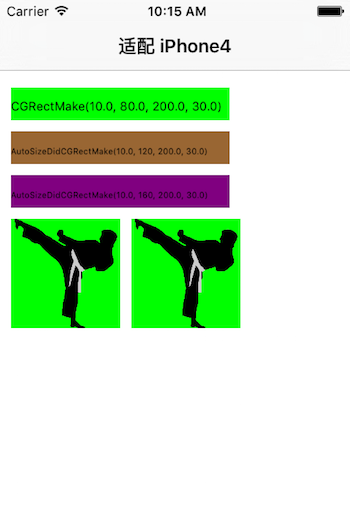
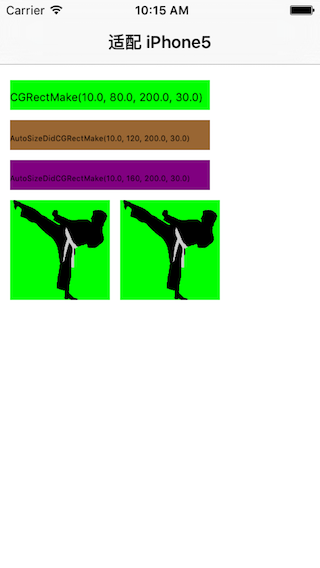
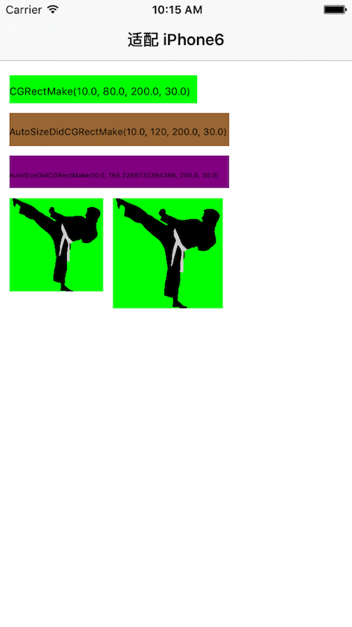
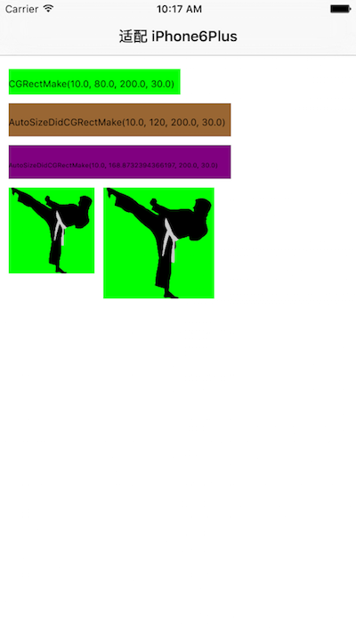

# SYUIAutolayout
UI控件多屏适配

个人以为在设置UI的frame时，主要是设置x、y坐标，以及宽、高。因此在进行多屏适配时，可以忽略x、y坐标的处理，只需要处理宽、高即可，即根据不同版本的屏幕尺寸，进行相应比例的计算进行缩放处理。

在实际研发过程中进行适配时，主要注意以下几个方面：
* 1、高度，根据实际比例进行缩放处理；
* 2、宽度，根据实例比较进行缩放处理；如果同一水平方向有多个UI控件，则总宽度为屏幕宽，所有UI控件宽度总和不能超过总宽度；
* 3、特别指出，当图片显示的UI控件需要以正方形的样式显示时，宽度均以高度的比例进行缩放处理；

根据不同屏幕的尺寸比例进行等比例缩放处理，即重写CGRectMake方法，方法名为：AutoSizeDidCGRectMake，或AutoSizeShouldCGRectMake，等等。

# 使用示例
* 注：添加头文件"SYAutoSizeCGRect.h"
~~~ javascript
// 方法1
UIImageView *imageview = [[UIImageView alloc] initWithImage:[UIImage imageNamed:@"image"]];
[self.view addSubview:imageview];
imageview.backgroundColor = [UIColor greenColor];
// 方法1 宽高根据适配比例自动进行计算适配，图标设置非正方法
imageview002.frame = SYAutoSizeShouldCGRectMake(originX, originY, 100.0, 100.0, YES, YES);
~~~
~~~ javascript
// 方法2
UIImageView *imageview = [[UIImageView alloc] initWithImage:[UIImage imageNamed:@"image"]];
[self.view addSubview:imageview];
imageview.backgroundColor = [UIColor greenColor];
// 方法2 高根据适配比例自动进行计算适配，图标设置为正方法
CGFloat sizeImage = SYAutoSizeGetHeight(100.0);
imageview.frame = CGRectMake(originX, originY, sizeImage, sizeImage);
~~~
~~~ javascript
// 方法3
UIImageView *imageview = [[UIImageView alloc] initWithImage:[UIImage imageNamed:@"image"]];
[self.view addSubview:imageview];
imageview.backgroundColor = [UIColor greenColor];
// 方法3 宽高根据适配比例自动进行计算适配，图标设置非正方法
imageview.frame = SYAutoSizeDidCGRectMake(originX, originY, 100.0, 100.0);
~~~

# 效果示例
* iPhone4效果

 
* iPhone5效果

* iPhone6效果

 
* iPhone6Plus效果

* iPhone6s效果

 
* iPhone6sPlus效果

# 修改说明
* 20180207
  * 版本号：1.0.1
  * 添加iPhoneX适配宏主义

